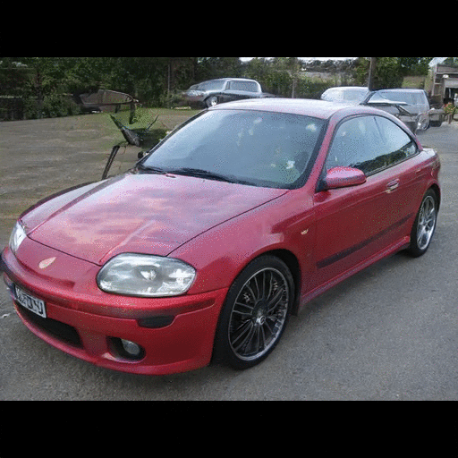
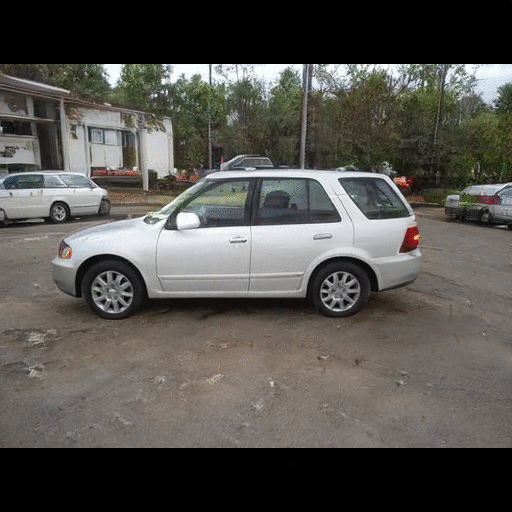
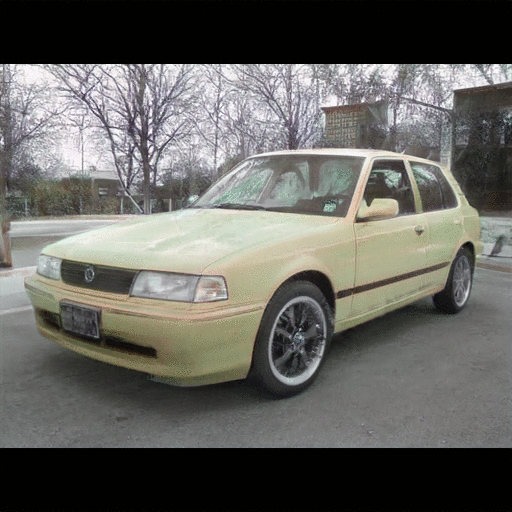
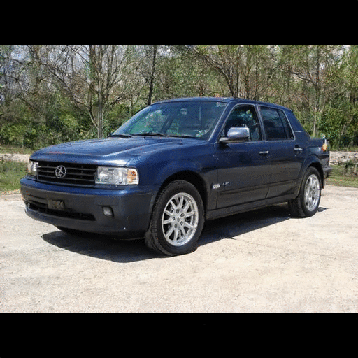
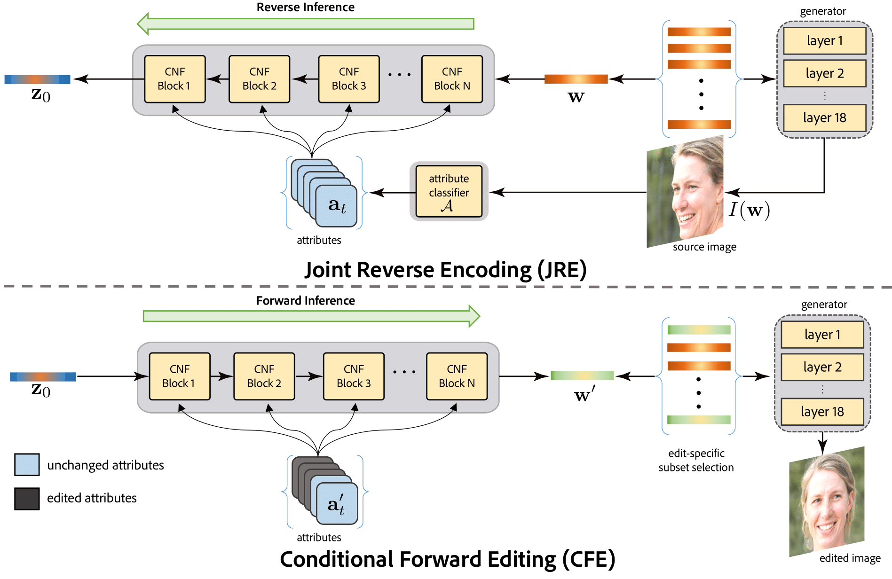
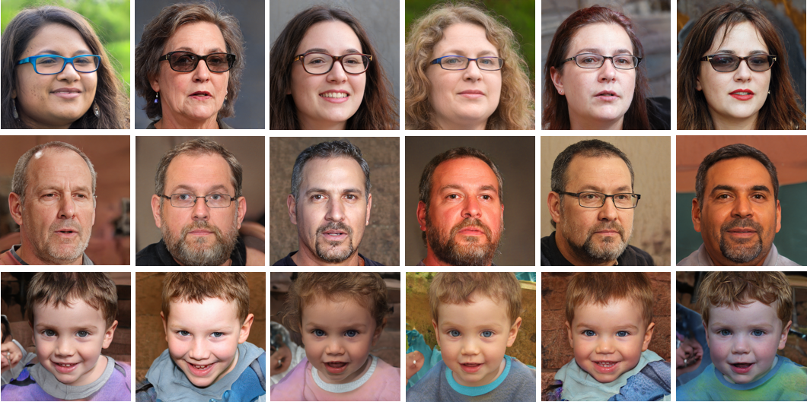
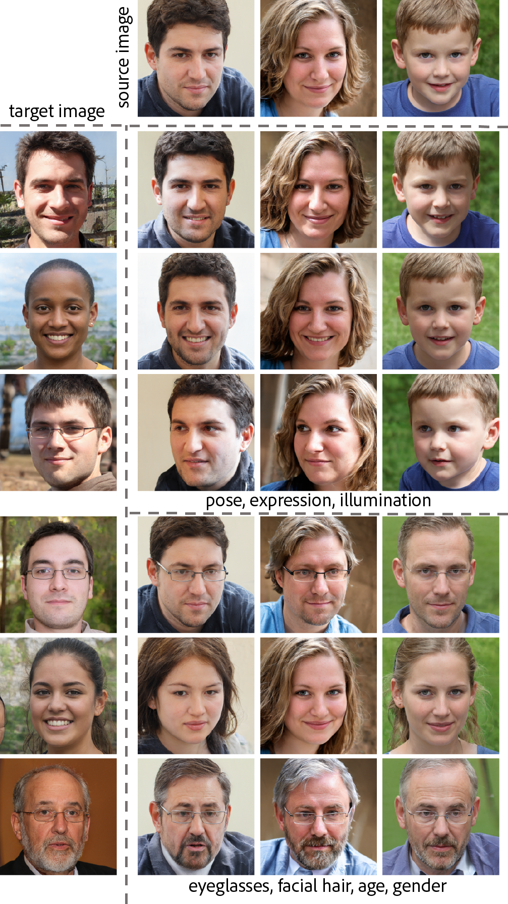
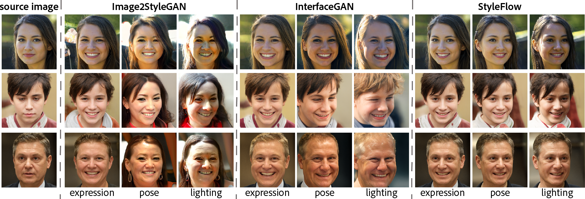
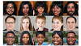

<h1>Abstract</h1>
 

 

High-quality, diverse, and photorealistic images can now be generated by unconditional GANs (e.g., StyleGAN). However, limited options exist to control the generation process using (semantic) attributes, while still preserving the quality of the output. Further, due to the entangled nature of the GAN latent space, performing edits along one attribute can easily result in unwanted changes along other attributes. In this paper, in the context of <em>conditional exploration</em> of entangled latent spaces, we investigate the two sub-problems of attribute-conditioned sampling and attribute-controlled editing. We present StyleFlow as a simple, effective, and robust solution to both the sub-problems by formulating  conditional exploration as an instance of conditional continuous normalizing flows in the GAN latent space conditioned by attribute features. We evaluate our method using the face and the car latent space of StyleGAN, and demonstrate fine-grained disentangled edits along various attributes. For example, for faces we vary camera pose, illumination variation, expression, skin tone, gender, and age. Finally, via extensive qualitative and quantitative comparisons, we demonstrate the superiority of StyleFlow to other parallel works.

<h1>Overview Video</h1>
 

  

   <iframe width="560" height="315" src="https://www.youtube.com/embed/yd5WczbFt68" frameborder="0" allow="accelerometer; autoplay; encrypted-media; gyroscope; picture-in-picture" allowfullscreen></iframe>
  

<h1>Method</h1>
 

 
 

Attribute-conditioned editing using StyleFlow. Starting from a source image, we support attribute-conditioned editing by using a reverse inference followed by a forward inference though a sequence of CNF blocks. Here, z denotes the variable of the prior distribution and w denotes the intermediate weight vector of the StyleGAN.

<h1>Sampling</h1>
 

 
 

Attribute-conditioned sampling using StyleFlow. Here we show sampling results for attribute specifications of \textit{females with glasses in a target pose}~(top); \textit{50-year old males with facial hair}~(middle); and \textit{smiling 5-year old children in a target pose}~(bottom).

<h1>Attribute Transfer</h1>
 

 
 

Attribute-conditioned edits where source images are edited using multiple attributes from the target images. Upper set uses pose, expression, and illumination from the respective target images; bottom set uses eyeglass, facial hair, age, and gender from the respective target images.

<h1>Comparison to Existing Methods</h1>
 

 
 

Comparison of StyleFlow with other contemporary systems Image2StyleGAN and InterfaceGAN.

<h1>Bibtex</h1>
 

<pre>
 @misc{abdal2019image2stylegan,
    title={Image2StyleGAN++: How to Edit the Embedded Images?},
    author={Rameen Abdal and Yipeng Qin and Peter Wonka},
    year={2019},
    eprint={1911.11544},
    archivePrefix={arXiv},
    primaryClass={cs.CV}
}
}
</pre>

<h1>Acknowledgements</h1>
 

  

   This work was supported by the KAUST Office of Sponsored Research (OSR) under AwardNo. OSR-CRG2018-3730.
  

<h1>Related Work</h1>
 

 
   

    
    <a href="https://github.com/NVlabs/stylegan">
      Tero Karras, Samuli Laine, Timo Aila.
      A Style-Based Generator Architecture for Generative Adversarial Networks
      CVPR, 2019.
    </a>
  

  

    
    <a href="https://github.com/NVlabs/stylegan">
      Tero Karras, Samuli Laine, Timo Aila.
      A Style-Based Generator Architecture for Generative Adversarial Networks
      CVPR, 2019.
    </a>
  

  

    
    <a href="https://github.com/NVlabs/stylegan">
      Tero Karras, Samuli Laine, Timo Aila.
      A Style-Based Generator Architecture for Generative Adversarial Networks
      CVPR, 2019.
    </a>
  

  

