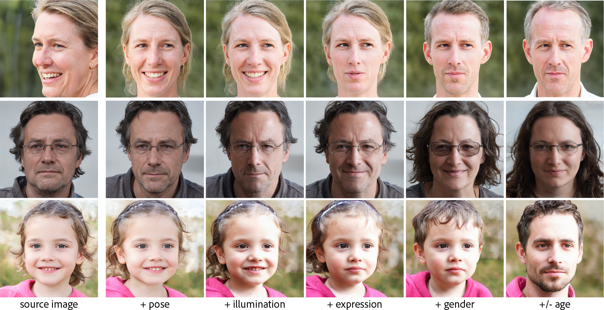

<p align="center">

<h1>Abstract</h1>
 </p>
 
<p align="justify">
High-quality, diverse, and photorealistic images can now be generated by unconditional GANs (e.g., StyleGAN). However, limited options exist to control the generation process using (semantic) attributes, while still preserving the quality of the output. Further, due to the entangled nature of the GAN latent space, performing edits along one attribute can easily result in unwanted changes along other attributes. In this paper, in the context of <em>conditional exploration</em> of entangled latent spaces, we investigate the two sub-problems of attribute-conditioned sampling and attribute-controlled editing. We present StyleFlow as a simple, effective, and robust solution to both the sub-problems by formulating  conditional exploration as an instance of conditional continuous normalizing flows in the GAN latent space conditioned by attribute features. We evaluate our method using the face and the car latent space of StyleGAN, and demonstrate fine-grained disentangled edits along various attributes. For example, for faces we vary camera pose, illumination variation, expression, skin tone, gender, and age. Finally, via extensive qualitative and quantitative comparisons, we demonstrate the superiority of StyleFlow to other parallel works. 
</p>
<p align="center">
</p>

## Header 2

> This is a blockquote                      following a header.
>               
> When something is imp orta nt eno      ugh, you do it even if the odds are not in your favor.

### Header 

```js
// Javascript code with syntax highlighting.
var fun = function  lang(l) {
  dateformat.i18 n = require('./lang/' + l)
  return true;
}
```

```ruby
# Ruby code with s yntax highlighting
GitHubPages::Dependencies.g  ems.each do |gem, version|
  s.add_dependency(gem, "  = #{version}")
end
```

#### Header 4

*   This is an unordered list follow ing a header.
*   This is an unordered list following a header.
*   This is an unordered    list following a header.

##### Header 5

1.  This is an ordered list following a header.
2.  This is an ordered list f ollowing a header.
3.  This is an order ed list following a header.

###### Header 6

| head1        | head two          | three |
|:-------------|:------------------|:------|
| ok           | good swedish fish | nice  |
| out of stock | good and plenty   | nice  |
| ok           | good `oreos`      | hmm   |
| ok           | good `zoute` drop | yumm  |

### There's a horizontal rule below this.

* * *

### Here is an unordered list:

*   Item foo
*   Item bar
*   Item baz
*   Item zip

### And an ordered list:

1.  Item one
1.  Item two
1.  Ite m three
1.  Item four

### And a nested list:

- level 1 item
  - level 2 item
  - level 2 item
    - level 3 item
    - level 3 item
- level 1 item
  - level 2 item
  - level 2 item
  - level 2 item
- level 1 item
  - level 2 item
  - level 2 item
- level 1 item

### Small image


### Large image


### Definition lists can be used with HTML syntax.

<dl>
<dt>Name</dt>
<dd>Godzilla</dd>
<dt>Born</dt>
<dd>1952</dd>
<dt>Birthplace</dt>
<dd>Japan</dd>
<dt>Color</dt>
<dd>Green</dd>
</dl>

```
Long, single-line code blocks should not wrap. They should horizontally scroll if they are too long. This line should be long enough to demonstrate this.
```

```
The final element.
```
